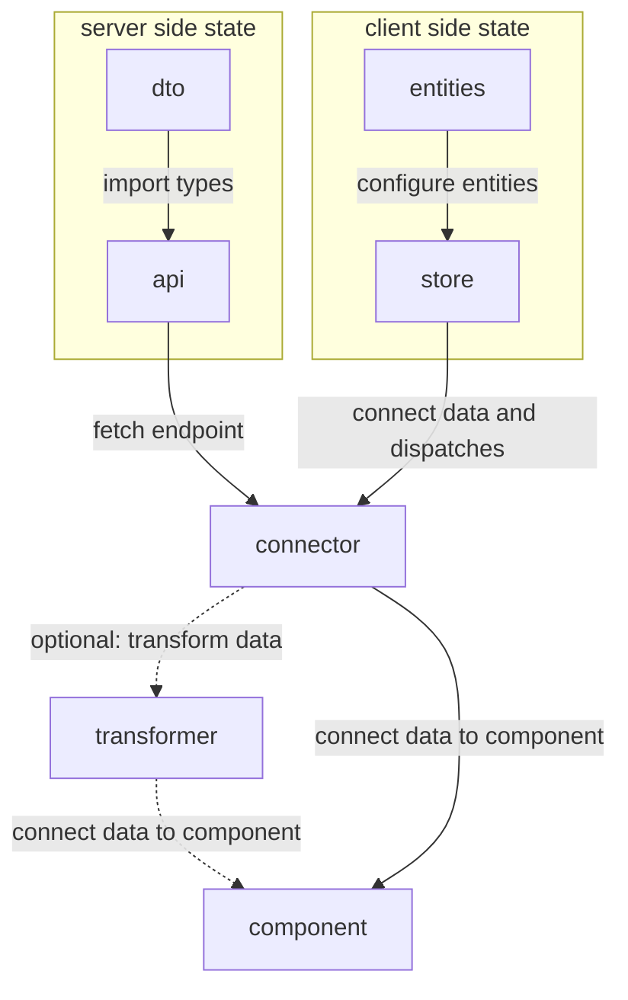

# Data flow

## Folder structure

```
.
└── src/
    ├── core/
    │   ├── services/
    │   │   ├── api-dto.ts
    │   │   └── api.ts
    │   └── store/
    │       ├── entities/
    │       │   └── [entity].ts
    │       └── configure.ts
    └── ui/
        └── components/
            └── [component]/
                ├── [component].connector.tsx
                └── [component].tsx
```

### Flow



### services/api-dto.ts
```ts
// An example of API response typing
export type ApiGetResponse = {
  "entity/[id]/": EntityDto;
};

type EntityDto = {
  id: string;
  title: string;
  body: string;
  date: string;
};
```
### services/api.ts
```ts
// An example of API service setup where DTO is connected to fetches
const api = {
  get<T extends keyof ApiGetResponse>(
    path: T,
    config?: Config
  ): Promise<ApiResponse<ApiGetResponse[T]>> {
    return wrapped("GET", endpoint + path, config || {});
  },
};
export default api;
```
### store/entities/[entity].ts
```ts
// An example of client side state using RTK
import { createSlice, PayloadAction } from "@reduxjs/toolkit";

const entitiesSlice = createSlice({
  name: "entities",
  initialState: { selected: undefined },
  reducers: {
    selectEntity: (state, action: PayloadAction<string>) => {
      state.selected = action.payload;
    },
  },
});

export const { selectEntity } = entitiesSlice.actions;

export default entitiesSlice.reducer;

```
### components/[component].connector.tsx
```ts
const EntityConnector = ({ id }) => {
  // Connect server state to components
  const { data } = useApi(`entity/${id}`);
  // Connect client state to components
  const entitySelected = useSelector(state => state.entities.selected === id);

  const onSelectEntity = (id: string) => {
    store.dispatch(selectEntity(id));
  };

  return (
    <EntityComponent
      id={data.id}
      selected={entitySelected}
      title={data.title}
      body={data.body}
      // Here we transform data if necessary.
      date={formatDate(data.date)}
      onSelect={onSelectEntity}
    />
  );
};
```
### components/[component].tsx
```tsx
// Keep this component dumb. Only handle layout changes or propegate user interaction.
const EntityComponent = ({ id, selected, title, body, onSelect }) => {
  return (
    <Touchable onPress={() => onSelect(id)}>
      <View style={[selected && $.selected]}>
        <Heading>{title}</Heading>
        <Text>{body}</Text>
      </View>
    </Touchable>
  );
};
```
