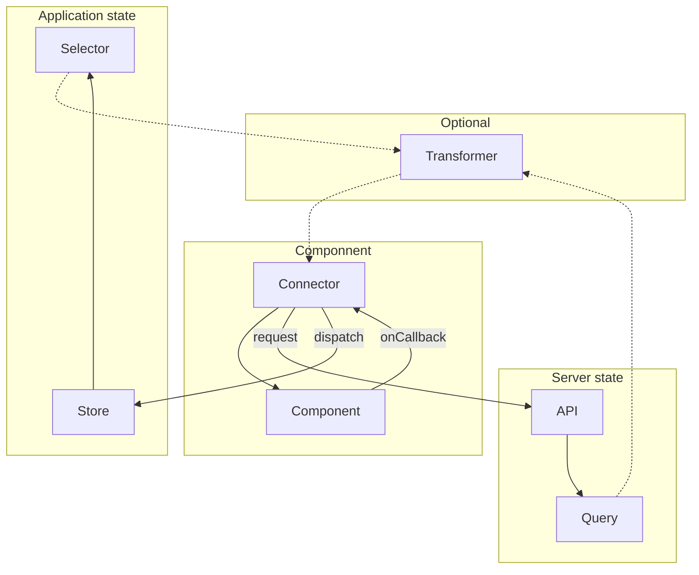

# Data Layers
> "A data access layer (DAL) in computer software is a layer of a computer program which provides simplified access to data stored in persistent storage of some kind."

Examples where a layer of data can exist:
- In a component also known as component state and accessed using hooks in React.
- On a server also known as server state and accessed using an API.
- In route parameters also known as URL state and accessed using Location Browser API.

Two keywords that are important in a data layer:
- __Store__: Where data is stored, for example a Firebase Database, indexedDB, localStore, React Query, Apollo Client Cache, Redux Store, etc.
- __State__: A snapshot of the store in a point of time representing the current state of the store.

## Table of contents
- [What is a store?](#what-is-a-store)
- [What is a state?](#what-is-a-state)
  - [Component state](#component-state)
  - [Application state](#application-state)
  - [Server Cache state](#server-cache-state)
  - [Route state](#what-is-a-store)
- [Data flow from store/server to component](#data-flow-from-storeserver-to-component)
  - [Folder structure](#folder-structure)
  - [When to use a transformer](#when-to-use-a-transformer)
  - [How to create a connector](#how-to-create-a-connector)

## What is a store?
In state management terms, a store is an object that holds the state of an application. It is a centralized place where you can store, update, and retrieve data that is used throughout your application.

In a typical state management system, the store is responsible for maintaining the application state, which consists of all the data and values that your application needs to function. This includes things like user data, application settings, and other important data.

## What is a state?
Within an application, wether it be build with React (Native) or Svelte, there are different types of state. So there is not a single centralized store where all your data lives:

### Component state
A component is a self-contained, reusable piece of code that can be used to create a UI element, such as a button, form, or menu. The state of a component represents the values that are specific to that component, which can change over time and affect how the component is rendered.

#### Examples

<details>
<summary>React (Native) with useState - Used for simple toggles or collapsing/expanding</summary>

```jsx
import React from "react";
import { Switch } from "react-native";

const Toggle: React.FC = () => {
    const [toggled, setToggled] = React.useState(false);

    return <Switch onValueChange={() => setToggled(!toggled)}  />;
};

export default Toggle;
```
</details>

<details>
<summary>React (Native) with useReducer - Used for more complex state like forms</summary>

```tsx
import React from "react";
import { Button, Switch, Text, TextInput } from "react-native";
import { TouchableOpacity } from "react-native-gesture-handler";

type SleepPosition = "belly-first" | "left-side" | "right-side";

type ActionResetForm = {
  type: "RESET_FORM";
};
type ActionSetEmailAddress = {
  type: "SET_EMAIL_ADDRESS";
  payload: string;
};
type ActionSetReceivingAnnoyingMarketingEmails = {
  type: "SET_RECEIVING_ANNOYING_MARKETING_EMAILS";
  payload: boolean;
};
type ActionSetSleepPosition = {
  type: "SET_SLEEP_POSITION";
  payload: SleepPosition;
};

type Action =
  | ActionResetForm
  | ActionSetEmailAddress
  | ActionSetReceivingAnnoyingMarketingEmails
  | ActionSetSleepPosition;

type State = {
  emailAddress: string;
  receiveAnnoyingMarketingEmails: boolean;
  sleepPosition: SleepPosition;
};

const defaultState: State = {
  emailAddress: "",
  receiveAnnoyingMarketingEmails: false,
  sleepPosition: "belly-first",
};

const reducer = (state: State, action: Action) => {
  switch (action.type) {
    case "RESET_FORM": {
      return defaultState;
    }
    case "SET_EMAIL_ADDRESS": {
      return {
        ...state,
        emailAddress: action.payload,
      };
    }
    case "SET_RECEIVING_ANNOYING_MARKETING_EMAILS": {
      return {
        ...state,
        receiveAnnoyingMarketingEmails: action.payload,
      };
    }
    case "SET_SLEEP_POSITION": {
      return {
        ...state,
        sleepPosition: action.payload,
      };
    }
    default: {
      throw new Error(`Action type not supported`);
    }
  }
};

const NewsLetterSubscribe: React.FC = () => {
  const [state, dispatch] = React.useReducer(reducer, defaultState);

  return (
    <>
      <Switch
        onValueChange={(toggled) =>
          dispatch({
            type: "SET_RECEIVING_ANNOYING_MARKETING_EMAILS",
            payload: toggled,
          })
        }
      />
      <TouchableOpacity
        style={state.sleepPosition === "belly-first" && styles.active}
        onPress={() =>
          dispatch({ type: "SET_SLEEP_POSITION", payload: "belly-first" })
        }
      >
        <Text>Belly first</Text>
      </TouchableOpacity>
      <TouchableOpacity
        style={state.sleepPosition === "left-side" && styles.active}
        onPress={() =>
          dispatch({ type: "SET_SLEEP_POSITION", payload: "left-side" })
        }
      >
        <Text>Left side</Text>
      </TouchableOpacity>
      <TouchableOpacity
        style={state.sleepPosition === "right-side" && styles.active}
        onPress={() =>
          dispatch({ type: "SET_SLEEP_POSITION", payload: "right-side" })
        }
      >
        <Text>Right side</Text>
      </TouchableOpacity>
      <TextInput
        placeholder="Email-Address"
        onChangeText={(text) =>
          dispatch({ type: "SET_EMAIL_ADDRESS", payload: text })
        }
      />
      <Button
        onPress={() => dispatch({ type: "RESET_FORM" })}
        title="Reset form"
      />
    </>
  );
};

export default NewsLetterSubscribe;
```
</details>

### Application state
If you want to keep state on a more global level that doesn't live server side you want to consider Application state. State that can represent stuff like: theming, settings, notifications, open modals, etc.

You need to consider if your state needs to live on app level or can be nested deeper down your app tree. Sometimes a state only is relevant to specific subset of pages. In that case define it on a lower level to prevent dropping performance for the whole app.

#### Examples

<details>
<summary>React (Native) with context + hooks - (...write usecase)</summary>
</details>

<details>
<summary>React (Native) with RTK + hooks - (...write usecase)</summary>
</details>


### Server Cache state
When fetching data from an external API we can store that data in a client side cache. This has several benefits:
- Reduce amount of API calls to the server.
- Have data available while new data is being fetched.
- Easy to use the same API query multiple times, without multiple fetches.

There are also a couple of downsides:
- Need to think about invalidating cache.
- Resolve conflicts between existing and incoming data in the cache.

#### Examples

<details>
<summary>React (Native) with React Query (REST) - (...write usecase)</summary>
</details>

<details>
<summary>React (Native) with Apollo Query (GraphQL) - (...write usecase)</summary>
</details>

### Route state
State that is stored in the route. For web that means it can be found in the address bar of the browser. Within React Native it means route params for each screen (stack/tab).

#### Examples

<details>
<summary>NextJS??  - (...write usecase)</summary>
</details>

<details>
<summary>React with React Router + hooks  - (...write usecase)</summary>
</details>

<details>
<summary>React with React Navigation + hooks  - (...write usecase)</summary>
</details>


## Data flow from store/server to component
There are some key parts to have a well designed server/application state flow from the your API/Store to your UI components:
- Define your API/Store apart from your UI.
- Define functions that can request data from your API/Store.
- (Optional): Define a transformer when API data needs to be formatted ([When to use a transformer](#when-to-use-a-transformer))
- Define a connector that connects to your API/Store ([How to create a connector](#how-to-create-a-connector)).
- Add your component(s) to display the data ([Write dumb components](https://github.com/wearetriple/web-defaults/blob/main/components.md#what-is-dumb-component))

This is how your data should flow in your application:



### Folder structure
This folder structure separates parts of your application based on their type rather than their feature. A lot of stuff is left out and it only shows where the parts discussed above should live.
```
.
└── src/
    ├── core/
    │   ├── services/
    │   │   └── api.ts
    │   ├── store/
    │   │   └── store.ts
    │   └── transformers/
    │       └── transformer.ts
    └── ui/
        └── components/
            └── article/
                ├── article.connector.tsx
                └── article.tsx
```


### When to use a transformer
Transformers can be used to transform API data in your application if the data received from the API is in a raw or unstructured format, and needs to be processed and transformed into a format that can be easily consumed by your application, for example:

1. <b>Data Cleaning</b>: If the data received from the API is in a messy or unstructured format.

2. <b>Data Normalization</b>: If the API data is in different formats, transformers can be used to normalize the data into a consistent format that can be easily processed by your application.

3. <b>Data Augmentation</b>: If the API data is limited, transformers can be used to augment the data by generating new data based on the existing data.

4. <b>Data Integration</b>: If the API data needs to be combined with other data sources, transformers can be used to integrate the data by mapping it to a common schema or ontology.

Downsides to using transformers:
1. <b>Impact on performance</b>: Need more computation power.
2. <b>Extra complexity</b>: Data from the API is not the same as used in the application.
3. <b>Taking responsibility</b>: The backend should deliver clean and structured data. Please discuss with backend first before adding transformers. Frontend is not supposed to take ownership in the backend data.


#### Example of transformer
@TODO

### How to create a connector
@TODO
