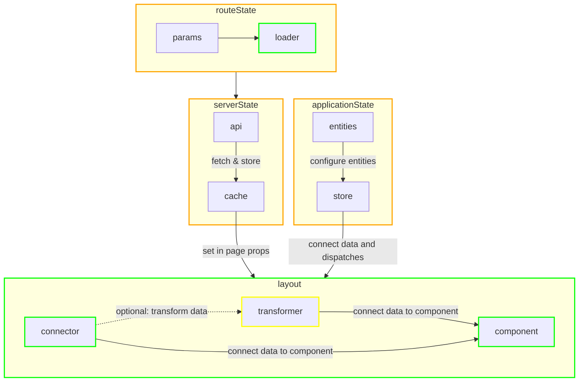

# 📡 Data
The application you are building will transform data to a user interface using a framework like React or Svelte. Meaning you will retrieve data from one or more sources like an API, state management library or query params. It forms a layer over your application where your code knows how to form that layer into a workable UI.

Examples where a layer of data can exist:
- In a component also known as component state and accessed using hooks in React or a variable in Svelte.
- On a server also known as server state and accessed using an API.
- In route parameters also known as URL state and accessed using Location Browser API.

Two keywords that are important in a data layer:
- __Store__: Where data is stored, for example a Firebase Database, indexedDB, localStore, React Query, Apollo Client Cache, Redux Store, etc.
- __State__: A snapshot of the store in a point of time representing the current state of the store.

## Index
- [What is a store?](#what-is-a-store)
- [What is a state?](#what-is-a-state)
  - [Component state](#component-state)
  - [Application state](#application-state)
  - [Server Cache state](#server-cache-state)
  - [Route state](#route-state)
- [From state to component](#data-flow-from-store-to-component)
  - [Connecting or displaying data](#connecting-or-displaying-data)
  - [State management](#state-management)
  - [Transform/formatting data](#transform-formatting-data)
  - [Examples](#examples)
  - [When to use a connector](#when-to-use-a-connector)
  - [When to use a transformer](#when-to-use-a-transformer)

## Useful links
- [💬 Response Typing](response-typing.md)
- [🗄️ Project structure](project-structure.md)
- [🧱 Components](components.md)

## What is a store?
In state management terms, a store is an object that holds the state of an application. It is a centralized place where you can store, update, and retrieve data that is used throughout your application.

In a typical state management system, the store is responsible for maintaining the application state, which consists of all the data and values that your application needs to function. This includes things like user data, application settings, and other important data.

## What is a state?
Within an application, wether it be build with React (Native) or Svelte, there are different types of state. So there is not a single centralized store where all your data lives:

### Component state
A component is a self-contained, reusable piece of code that can be used to create a UI element, such as a button, form, or menu. The state of a component represents the values that are specific to that component, which can change over time and affect how the component is rendered.

### Application state
If you want to keep state on a more global level that doesn't live server side you want to consider Application state. State that can represent stuff like: theming, settings, notifications, open modals, etc.

You need to consider if your state needs to live on app level or can be nested deeper down your app tree. Sometimes a state only is relevant to specific subset of pages. In that case define it on a lower level to prevent dropping performance for the whole app.

### Server Cache state
When fetching data from an external API we can store that data in a client side cache. This has several benefits:
- Reduce amount of API calls to the server.
- Have data available while new data is being fetched.
- Easy to use the same API query multiple times, without multiple fetches.

There are also a couple of downsides:
- Need to think about invalidating cache.
- Resolve conflicts between existing and incoming data in the cache.

### Route state
State that is stored in the route. For web that means it can be found in the address bar of the browser. Within React Native it means route params for each screen (stack/tab).


## From state to component
Looking at how applications work you can state that a user always start with a route state:
- A user navigates to page;
- A user reloads a page;
- A user comes from an external source (like a deeplink);

Consider this flow for your application where it starts from a route and ends in component(s):



> Looking for how to structure this flow in your application, see [project structure](project-structure.md) documentation.

<style>
  .marker {
    border-width:1px;
    border-style:solid;
    display:inline-block;
    width:10px;
    height:10px;
    margin-right: 10px;
  }
  .lime {
     border-color:lime;
  }
  .yellow {
     border-color:yellow;
  }
  .orange {
     border-color:orange;
  }
</style>

<h3><span class="marker lime"></span>Connecting or displaying data</h3>

| Element      | Description                                                                                                                                          |
|-----------|------------------------------------------------------------------------------------------------------------------------------------------------------|
| Loader    | Based on the route and its params it can load data. Looking at Next.js, Svelte or React Router v6 they expose a loader function based on each route. |
| Layout    | Structures components and connectors to display a page/screen to the user. Always included through a route.                                          |
| Connector | Connects data from server or application state to components and optionally transforms/formats it. Also the propagated actions from components are handled by the connector. It keeps components 'dumb' and functional. Read more: [When to use a connector](#when-to-use-a-connector).                      |
| Component | A 'dumb' component only responsible for displaying data and propagating actions to its connector or layout. Read more: [What is dumb component?](components.md#what-is-dumb-component)                                          |

To make it easier refer to this overview to see the scope for each element:

|           | Route State | Server State | Application State | Component State | Transformer |
|-----------|-------------|--------------|-------------------|-----------------|-------------|
| Loader    | ✅           | ✅            | ⛔️                | ⛔️              | ⛔️          |
| Layout    | ⛔️          | ✅            | ✅                 | ⛔️              | ⛔️          |
| Connector | ⛔️          | ✅            | ✅                 | ✅               | ✅           |
| Component | ⛔️          | ⛔️           | ⛔️                | ✅               | ⛔️          |


<h3><span class="marker orange"></span>State management</h3>

| Element              | Description                                                                           |
|-------------------|---------------------------------------------------------------------------------------|
| Route State       | Handled by your solution of choice: Next.js, Svelte or React Router.                  |
| Server State      | Handled by your solution of choice: Vanilla fetch, React Query, Apollo, etc.          |
| Application State | Handled by your solution of choice: React Context, Svelte stores, Redux Toolkit, etc. |


<h3><span class="marker yellow"></span>Transform/formatting data</h3>

| Element    | Description                                                                                                                                                           |
|------------|-----------------------------------------------------------------------------------------------------------------------------------------------------------------------|
| Transformer | Util function for transforming/formatting data to display prices, dates. Or transforming arrays to flatten them or calculating a totalPrice for multiple order lines. Read more: [When to use a transformer](#when-to-use-a-transformer). |


### Examples

<details>
<summary>React with React Router DOM v6</summary>

```ts
// Element: Loader
export function todoLoader({ params }: TodoRoute) {
  // Route state -> Connect route params to fetch from server state
  // Server state -> API service will fetch the server (cache) state
  return api.get(`/api/todos/${params.id}`);
}
```
```tsx
// State manager: Route
const router = createBrowserRouter([
  {
    path: "/todo/:id",
    // imported from loaders
    loader: todoLoader,
    // using id to connect route state to hooks
    id: 'TodoItem',
    // imported from layouts
    element: <TodoLayout />,
  },
]);

ReactDOM.createRoot(el).render(<RouterProvider router={router} />);
```
```tsx
// Element: Layout
const TodoLayout = () => {
  // Server state -> Seems route state, but the return of loader data is from the server (cache) state.
  const todo = useRouteLoaderData("TodoItem");
  // Server state -> Get rights and roles from server or cache.
  const { data: rightsAndRoles } = useQuery(QueryRightAndRoles);

  return (
    // Structures components in a layout
    <section classname={$.container}>
      <div classname={$.flex}>
        <TodoHeader image={todo.image.url} />
        <TodoItemConnector />
      </div>
      {/* Hide/show todo creation based on rights of the current user */}
      {rightsAndRoles.includes('todo-creation') &&
        <div classname={$.sticky}>
          <TodoCreate />
        </div>
      }
    </section>
  );
};
```
```tsx
// Element: Connector
const TodoItemConnector = ({ children }) => {
  // Server state -> Seems route state, but the return of loader data is from the server (cache) state.
  const todo = useRouteLoaderData("TodoItem");
  // Server state -> Connect extra data to TodoItem
  const { data: todoAssignee } = useQuery(QueryTodoAssignee, { variables: todo.id });
  // Application state -> Connect app settings to TodoItem
  const dispatch = useDispatch()
  const showTodoTimeStamp = useSelector(
    (state) => state.appSettings.showTodoTimeStamp
  );

  // Handle action of TodoItem, update application state
  const onToggle = () => {
    dispatch(setTodoChecked(todo.id, !todo.checked));
  };

  return (
    <TodoItem
      title={todo.title}
      onToggle={onToggle}
      checked={todo.checked}
      assignedTo={todoAssignee.fullName}
      assignedProfilePic={todoAssignee.image}
      // Here we transform data if needed. In this case we want to format time to readable format.
      time={showTodoTimeStamp ? formatTime(todo.time) : null}
    />
  );
};
```
```tsx
// Element: Component
const TodoItem = ({ title, checked, onToggle, time, assignedTo, assignedProfilePic }) => {
  return (
    <section classname={$.container}>
      <h2 classname={$.heading}>{title}</h2>
      <Avatar name={assignedTo} image={assignedProfilePic} />
      <input type="checkbox" checked={checked} onChange={onToggle} classname={$.checkbox} />
      {time && <p classname={$.time}>{time}</p>}
    </section>
  );
};
```
</details>

> More examples can be added/suggested by developers.

### When to use a connector
It is not obligatory to use a connector in your application but it can be helpful for example:
1. <b>Combining multiple states</b>: You need to combine server and application state into component props. For example you have a collection of books, but the selection state is only locally available.

2. <b>Reusability</b>: You want to use a certain component with a piece of application state in multiple locations of your app. For example the totalprice of your shopping cart.

3. <b>Direct coupling</b>: Have your data close to the component. Within React you will benefit from this: prevent unnecessary rerenders of components that do not use a specific slice of server/application state.

### When to use a transformer
Transformers can be used to transform API data in your application if the data received from the API is in a raw or unstructured format, and needs to be processed and transformed into a format that can be easily consumed by your application, for example:

1. <b>Data Cleaning</b>: If the data received from the API is in a messy or unstructured format.

2. <b>Data Normalization</b>: If the API data is in different formats, transformers can be used to normalize the data into a consistent format that can be easily processed by your application.

3. <b>Data Augmentation</b>: If the API data is limited, transformers can be used to augment the data by generating new data based on the existing data.

4. <b>Data Integration</b>: If the API data needs to be combined with other data sources, transformers can be used to integrate the data by mapping it to a common schema or ontology.

Downsides to using transformers:
1. <b>Impact on performance</b>: Need more computation power.
2. <b>Extra complexity</b>: Data from the API is not the same as used in the application.
3. <b>Taking responsibility</b>: The backend should deliver clean and structured data. Please discuss with backend first before adding transformers. Frontend is not supposed to take ownership in the backend data.
